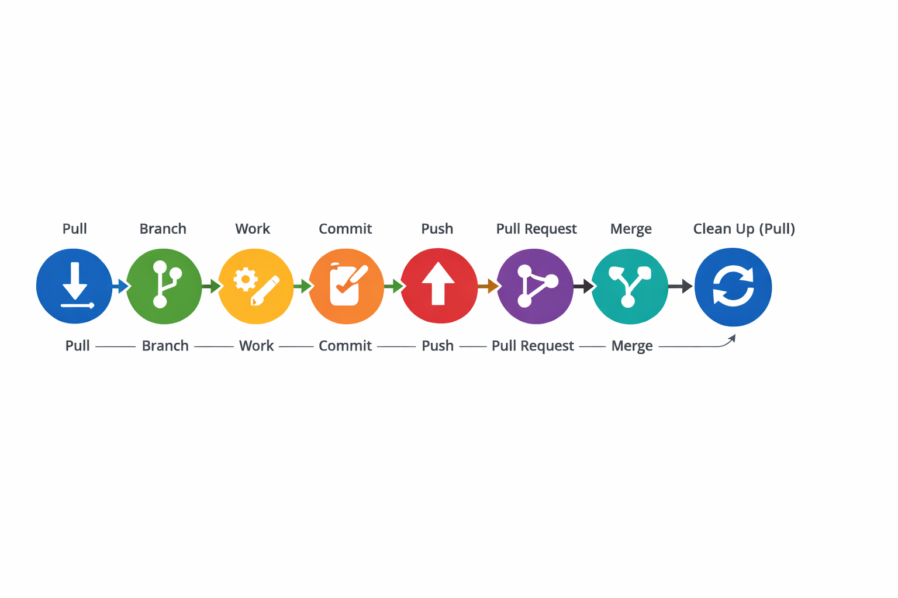

# Contributor Guide

## Python vs Shell Scripts

This project follows a Python-first, shell-optional workflow to ensure that all contributors can work collectively and reproducibly across operating systems (macOC vs Linux).

Please read this carefully before running or modifying the pipeline.

## Core Format

Python scripts do the work.
Shell scripts launch Python scripts, create logs, stop when execution fails.

### Python

Use Python when you are:

- Running training, inference, or evaluation

- Executing any step that: creates models, produces predictions, writes metrics, or generates reports

- Exploring or visualizing data (via .py scripts)

- Debugging or modifying pipeline logic

- Working with configs (configs/*.yaml)

Note: Python code is found in the following directories:

run/ → official execution entry points
(what everyone should run from the terminal)

src/ → reusable logic (no execution side effects)

explore/ → exploratory / visualization scripts (.py only)

**Example**
(bash)
python run/train.py --config configs/train.yaml
python run/infer.py --config configs/infer.yaml

### Shell Scripts

Shell scripts are an optional but efficient way to run the project.

Use Shell scripts when you want:

- A one-line shortcut to run an existing Python command

- To chain multiple Python steps together

- To run the entire pipeline end-to-end without typing many commands

Note: Shell scripts are found in the Scripts/ directory.

**Note**
Shell scripts call Python commands, pass config files to Python, and exit if something fails.

## DO NOT DO

🚫 Do not put pipeline logic in shell scripts
🚫 Do not train models inside notebooks
🚫 Do not run hidden steps only from Jupyter
🚫 Do not duplicate logic across Python and Bash.

## Exploration vs Execution

This project separates execution from exploration.

**Execution** (reproducible, official)

- Location: run/

- Format: .py scrips

- Run via terminal

- Uses YAML configs

- Produces tracked outputs

**Exploration** (safe, disposable)

- Location: explore/

- Format: .py scripts or .ipynb notebooks

- Used for: sanity checks, visual overlays, error analysis, figure generation

**Note:** Exploration scripts should:

- read existing outputs

- save figures/tables to outputs/

- never train or infer models.

## Work Flow

Pull → Branch → Work → Push → Pull Request → Merge → Clean up (Pull)
