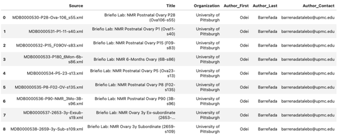
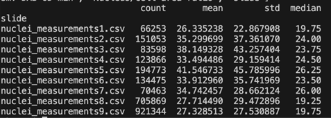
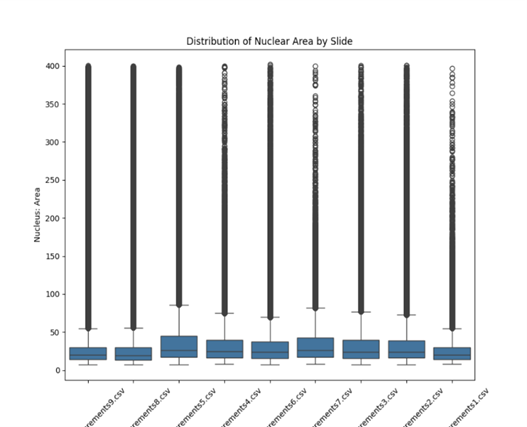
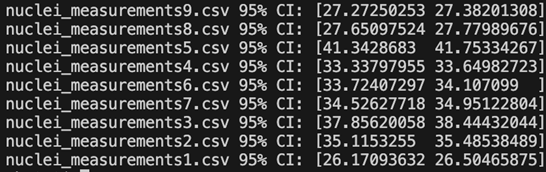

# Appendix – Supplementary Materials 
## Machine-Learning Histology Analysis of Heterogeneous glaber  

Julian Coles, Martin Orkuma, Pamela Styborski, and Silvia Tenempaguay-Nunez

**Table of Contents**

A. Data Source and Ingestion
- Data injestion code

B. Data Quality Assessment & Cleaning
- File presence checks
- XML integrity and filename consistency checks

C. Supplementary Tables 

D. Supplementary Code 

- Python code for data composition of .xml files (Objective 1 Table 1) 
- Python code for data composition of .xml files (Objective 1 Table 2) 
- Python code for data composition of .xml files (Objective 1 Table 3) 
- Image-level characteristics summary (Table 4) 
- Python code to create tissue-specific RBG histograms (Figure 1) 
- Python code used for plotting and running analysis with QuPath provided metrics
- Python code to create a montage of whole-slide images

E. Additional Figures 
- Supplemental Figure 1 - Cell and Nucleus Count Summary per Slide
- Supplemental Figure 2 - Boxplot Representation of the Distribution of Nuclear Area Across all 9 Slides
- Supplemental Figure 3 - Bootstrapping output from QuPath Analysis 
- Supplemental Figure 4 - Montage showing all 9 whole-image slides

F. References 


## Data Ingestion

The datasets used in this analysis were obtained from the MOTHER Database: https://mother-db.org/search/  

Download script: scripts/download_mother_nmr.sh 

https://github.com/ReproAnalytics/nmr-ovarian-follicle-ml/blob/main/scripts/download_mother_nmr.sh  

```Bash 
#!/usr/bin/env bash 
# Goal: To download nmr histology data from the MOTHER database.
set -euo pipefail 

SEARCH_URL="https://mother-db.org/search/?_sfm_genus_taxon_rank_value=Heterocephalus&_sfm_species_taxon_rank_value=Heterocephalus%20glaber" 

# Where to store downloads, run from repo root and adjust to match your repo layout. 
DEST_ROOT="${1:-data/raw/H_glaber}" 

mkdir -p "$DEST_ROOT" 

echo "Fetching search page..." 

search_html="$(curl -fsSL "$SEARCH_URL")" 

# Extract unique accession IDs like MDB0000530 
mapfile -t accessions < <(printf "%s" "$search_html" \ 

  | grep -oE 'MDB[0-9]{7}' \ 

  | sort -u) 

 
if [[ "${#accessions[@]}" -eq 0 ]]; then 

  echo "X - No accessions found on the search page. Page structure may have changed." 

  exit 1 

fi 

echo "Found ${#accessions[@]} accessions:" 

printf " - %s\n" "${accessions[@]}" 

echo 

echo "Downloading resources to: $DEST_ROOT" 

echo 

for acc in "${accessions[@]}"; do 

  echo "==> $acc" 

  acc_dir="$DEST_ROOT/$acc" 

  mkdir -p "$acc_dir" 

  folder_url="https://mother-db.org/resource-folder/?path=${acc}" 

  # Fetch the resource-folder HTML and extract direct file links 
  folder_html="$(curl -fsSL "$folder_url")" 

  mapfile -t file_urls < <(printf "%s" "$folder_html" \ 

    | grep -oE 'https?://resources\.mother-db\.org[^"]+' \ 

    | sort -u)  

  if [[ "${#file_urls[@]}" -eq 0 ]]; then 

    echo "X - No resource links found for $acc (skipping)." 

    continue 

  fi  

  # Download each file (resume supported with -C -) 
  for url in "${file_urls[@]}"; do 

    fname="$(basename "${url%%\?*}")" 

    outpath="$acc_dir/$fname" 

    if [[ -f "$outpath" ]]; then 

     	echo "  - exists: $fname (skipping)" 

      	continue 

    fi 

    echo "  - downloading: $fname" 

    curl -fL -C - -o "$outpath" "$url" 

  done 

  echo 

done 
echo "Done!" 
```


## Data Quality Assessment & Cleaning

File presence checks.

```Python 
# File presence check: 
def scan_donor_folder(donor_dir: Path) -> DonorRow: 
    warnings: List[str] = [] 

    accession_id = donor_dir.name 

    issues: List[str] = [] 


    tiff_path, tiff_hits = find_single_file(donor_dir, TIFF_EXTS) 

    xml_path, xml_hits = find_single_file(donor_dir, (XML_EXT,)) 

    reduced_png = find_png_by_suffix(donor_dir, EXPECTED_PNG_SUFFIXES[0]) 

    thumbnail_png = find_png_by_suffix(donor_dir, EXPECTED_PNG_SUFFIXES[1]) 

 

    if tiff_path is None: 

        issues.append("missing_tiff" if len(tiff_hits) == 0 else f"multiple_tiffs({len(tiff_hits)})") 

    if xml_path is None: 

        issues.append("missing_xml" if len(xml_hits) == 0 else f"multiple_xmls({len(xml_hits)})") 

    if reduced_png is None: 

        issues.append("missing_reduced_png") 

    if thumbnail_png is None: 

        issues.append("missing_thumbnail_png") 

 
    row = DonorRow( 

        accession_id=accession_id, 

        donor_dir=str(donor_dir.as_posix()), 

        tiff_path=str(tiff_path.as_posix()) if tiff_path else "", 

        xml_path=str(xml_path.as_posix()) if xml_path else "", 

        reduced_png_path=str(reduced_png.as_posix()) if reduced_png else "", 

        thumbnail_png_path=str(thumbnail_png.as_posix()) if thumbnail_png else "", 

        ok=len(issues) == 0, 

        issues=issues, 

        warnings=warnings, 

        tiff_candidates=";".join([p.name for p in tiff_hits]), 

        xml_candidates=";".join([p.name for p in xml_hits]), 

    ) 

 

    # TIFF sizes + header hints 
    if tiff_path and tiff_path.exists(): 

        row.tiff_size = tiff_path.stat().st_size 

        qc = tiff_quickcheck(tiff_path) 

        row.tiff_pages = qc.get("tiff_pages")  # type: ignore 

        row.tiff_series_count = qc.get("tiff_series_count")  # type: ignore 

        row.tiff_is_ome = qc.get("tiff_is_ome")  # type: ignore 

        row.tiff_shape_hint = qc.get("tiff_shape_hint")  # type: ignore 

        if tifffile is not None and row.tiff_pages is None: 

            row.issues.append("tiff_unreadable_header") 
``` 

XML integrity and filename consistency checks

```Python
    # XML sizes + metadata extraction
    if xml_path and xml_path.exists():
        row.xml_size = xml_path.stat().st_size
        try:
            meta = parse_mother_xml(xml_path)
            for k, v in meta.items():
                setattr(row, k, v)
        except Exception as e:
            row.issues.append(f"xml_parse_error({e.__class__.__name__})")

        # Validate that mdb block exists (donorID/slideID are good proxies)
        if row.donorID is None and row.slideID is None:
            row.issues.append("xml_missing_mdb_mother_block")

        # Filename consistency checks using slideID / donorID if present (warnings only)
        fnames = " ".join([p.name for p in donor_dir.iterdir() if p.is_file()]).lower()
        fn_norm = normalize_for_match(fnames)

        if row.slideID:
            slide_norm = normalize_for_match(row.slideID)
            if slide_norm and slide_norm not in fn_norm:
                row.warnings.append("slideID_not_in_filenames")

        if row.donorID:
            donor_norm = normalize_for_match(row.donorID)
            if donor_norm and donor_norm not in fn_norm:
                row.warnings.append("donorID_not_in_filenames")

    if reduced_png and reduced_png.exists():
        row.reduced_png_size = reduced_png.stat().st_size
    if thumbnail_png and thumbnail_png.exists():
        row.thumbnail_png_size = thumbnail_png.stat().st_size
```

## Supplementary Tables

Supplemental Table I: Source information for .xml data pulled from MOTHER  




## Supplementary Python Code

**Python Code for Data Composition of .xml files – Objective 1 Table 1**  

```Python 
# import pandas library and security bypass 
import pandas as pd import requests  
# XML files have complex element trees 
# will require manual extraction so we import element trees here 
import xml.etree.ElementTree as ET  
import io 

 

# Add all xml files as urls 
urls = [  

"https://resources.mother-db.org/slides/MDB0000530/MDB0000530-P28-Ova-106_s55.xml",  

"https://resources.mother-db.org/slides/MDB0000531/MDB0000531-P1-11-s40.xml",  

"https://resources.mother-db.org/slides/MDB0000532/MDB0000532-P15_F09OV-s83.xml",  

"https://resources.mother-db.org/slides/MDB0000533/MDB0000533-P180_6Mon-6b-s86.xml",  

"https://resources.mother-db.org/slides/MDB0000534/MDB0000534-P5-23-s13.xml",  

"https://resources.mother-db.org/slides/MDB0000535/MDB0000535-P8-F02-OV-s135.xml",  

"https://resources.mother-db.org/slides/MDB0000536/MDB0000536-P90-NMR_3Mo-3B-s96.xml",  

"https://resources.mother-db.org/slides/MDB0000537/MDB0000537-2653-3y-Exsub-s19.xml",  

"https://resources.mother-db.org/slides/MDB0000538/MDB0000538-2659-3y-Sub-s109.xml"  

] 

 
# Create headers for all data frames 
# This has to be done before every table  
headers = {'User-Agent': 'Mozilla/5.0'} all_dfs = [] 

# Create for loop 

for url in urls:  

response = requests.get(url, headers=headers) 

if response.status_code == 200: 
		root = ET.fromstring(response.content) 
     
   	 	# Find data points 
    		record = { 
        			"Source": url.split('/')[-1], 
      		  	"Title": root.findtext(".//title").strip() if root.find(".//title") is not 				None else "N/A", 
        			"Organization": root.findtext(".//organizationName").strip() if 				root.find(".//organizationName") is not None else "N/A", 
 
        		# Find Primary Author 
    			"Author_First": root.findtext(".//creator//givenName").strip() if 				root.find(".//creator//givenName") is not None else "N/A", 
			        

 "Author_Last": root.findtext(".//creator//surName").strip() 	if root.find(".//creator//surName") is not 	None else "N/A", 
      	 

  "Author_Contact": root.findtext(".//creator//electronicMailAddress").strip() if root.find(".//creator//electronicMailAddress") is not None else "N/A", 
         
   } 
 
    all_dfs.append(record) 

# Combine into table 

final_df = pd.DataFrame(all_dfs) display(final_df) 
``` 

Python Code for Data Composition of .xml files – Objective 1 Table 2

```Python 

# Create headers for all data frames 
headers = {'User-Agent': 'Mozilla/5.0'}  

all_dfs = [] 

 

# Creating a second table of XML Data for Visualization 

# Define new term 
ns = {'mdb': 'http://mother-db.org/mdb'} 

 

# Create another for loop 
for url in urls:  

response = requests.get(url, headers=headers) 

if response.status_code == 200: 
   		 root = ET.fromstring(response.content) 
     
  	  # Find data points 
	    record2 = { 
  		      # Keep Source as a consistent point across tables 
    		    "Source": url.split('/')[-1], 
 
        		# Taxonomy  
    		    "Common Name": 			root.findtext(".//taxonRankName[.='Species']/../commonName") or "N/A", 
     

   "Scientific Name": root.findtext(".//taxonRankName[.='Species']/../taxonRankValue") or "N/A", 
        

 # Donor Information  
       "Donor ID": root.findtext(".//mdb:donorID", namespaces=ns) or "N/A", 
        "Donor Life Stage": root.findtext(".//mdb:donorLifeStage", namespaces=ns) or "N/A", 
        "Donor Sex": root.findtext(".//mdb:donorSex", namespaces=ns) or "N/A", 
        "Ovary Sampled": root.findtext(".//mdb:ovaryPosition", namespaces=ns) or "N/A", 
        "Slide ID": root.findtext(".//mdb:slideID", namespaces=ns) or "N/A" 
    } 
 
    all_dfs.append(record2) 
  

# Combine into table 
final_df = pd.DataFrame(all_dfs)  

display(final_df) 
```

Python Code for Data Composition of .xml files – Objective 1 Table 3 
```Python 

# Create headers for all data frames 
headers = {'User-Agent': 'Mozilla/5.0'} all_dfs = [] 

 

# Creating a third table of XML Data for Visualization 
# Redefine new term 
ns = {'mdb': 'http://mother-db.org/mdb'} 

 

# Create another for loop 
for url in urls:  

response = requests.get(url, headers=headers) 

if response.status_code == 200: 
		    root = ET.fromstring(response.content) 
     
	    # Find data points 
		    record3 = { 
		        # Keep Source as a consistent point across tables 
		        "Source": url.split('/')[-1], 
         
	   # Donor Information  
"Donor ID": root.findtext(".//mdb:donorID", namespaces=ns) or "N/A", 
       	 "Slide ID": root.findtext(".//mdb:slideID", namespaces=ns) or "N/A", 

    	    # Sample and Methods Information 
        		"Tissue Thickness": root.findtext(".//mdb:thickness", namespaces=ns) or "N/A", 
        		"Units": root.findtext(".//mdb:unit", namespaces=ns) or "N/A", 
       		 "Microscope Make and Model": root.findtext(".//mdb:notes", namespaces=ns) or "N/A" 
    } 
 
    all_dfs.append(record3) 
  

# Combine into table 
final_df = pd.DataFrame(all_dfs)  
display(final_df) 

```

**Image-Level Characteristics Summary**

```Python 

from PIL import Image 
import glob 
import pandas as pd 
import os 
import matplotlib.pyplot as plt 

# Path to H_glaber .png images 

img_dir = "~/nmr-ovarian-follicle-ml/data/raw/H_glaber/EDAreduced/" 

 
# Pull all H_glaber .png files 
img_paths = glob.glob(os.path.join(img_dir, "*.png")) 
summary_data = [] 
 

for img_path in img_paths: 
    print(f"Processing {img_path}") 
    try: 
        img = Image.open(img_path) 
        width, height = img.size 
        summary_data.append({ 
            "image_name": os.path.basename(img_path), 
            "width": width, 
            "height": height, 
            "mode": img.mode  # RGB, grayscale, etc. 

        }) 


    except Exception as e: 

        summary_data.append({ 

            "image_name": os.path.basename(img_path), 

            "width": "ERROR", 

            "height": "ERROR", 

            "mode": "ERROR" 

        }) 

 
# Save results to a .csv before turning into a formatted table  
df = pd.DataFrame(summary_data) 
df.to_csv("png_summary.csv", index=False) 

 

# Load the formatted .csv file  
df = pd.read_csv("formatted_slide_summary.csv") 

 

# Create figure and table  
fig, ax = plt.subplots(figsize=(12, 5)) 

ax.axis('off') 

table = ax.table( 

    cellText=df.values, 

    colLabels=df.columns, 

    cellLoc='center', 

    loc='center') 

 
# Turn off auto font scaling 
table.auto_set_font_size(False) 
table.set_fontsize(10) 

 

# Calculate max text length per column (including header) 
col_widths = [] 

for col in df.columns: 

    max_len = max( 

        df[col].astype(str).map(len).max(), 

        len(col)) 

    col_widths.append(max_len) 

 
# Normalize widths so they fit figure 
total = sum(col_widths) 
col_widths = [w / total for w in col_widths] 

 
# Format the table appropriately (apply width, scale, type-face) 

for i, width in enumerate(col_widths): 

    for j in range(len(df) + 1):  # +1 for header row 

        table[j, i].set_width(width) 

table.scale(1, 1.6) 

for (row, col), cell in table.get_celld().items(): 

    if row == 0: 

        cell.set_text_props(weight='bold') 

# Save figure as the slide summary table of all 9 images analyzed 
plt.savefig("slide_summary_table.png", bbox_inches='tight', dpi=300) 
plt.close()  

```

**Python code for creatingTissue-specific RBG histograms:**

```Python 

from PIL import Image 
import matplotlib.pyplot as plt 
import numpy as np 
import glob 
import os 

# Directories 
img_dir = "~ /nmr-ovarian-follicle-ml/data/raw/H_glaber/Histograms/TissueHist/" 

output_path = "~ /nmr-ovarian-follicle- 

ml/data/raw/H_glaber/Histograms/TissueHist/combined_tissue_histograms.png" 

# Get image paths to all 9 images 
img_paths = sorted(glob.glob(os.path.join(img_dir, "*.png")))[:9] 
n_images = len(img_paths) 

# Grid size of combined image cluster (3x3 for 9 images) 
rows = 3 
cols = 3 
fig, axes = plt.subplots(rows, cols, figsize=(15, 12)) 
axes = axes.flatten() 

for idx, img_path in enumerate(img_paths): 

    ax = axes[idx] 

    try: 

        img = Image.open(img_path).convert("RGB") 

        img_array = np.array(img) 

        # Tissue mask (remove background) 
        mask = np.mean(img_array, axis=2) < 240 

        tissue_pixels = img_array[mask] 

        if tissue_pixels.size == 0: 

            ax.set_title("No Tissue") 

            ax.axis("off") 

            continue 

 
        # Plot RGB histograms 

        for i, color in enumerate(['r', 'g', 'b']): 

            ax.hist(tissue_pixels[:, i], bins=256, alpha=0.4, density=True) 

        # Formatting 

        filename = os.path.basename(img_path) 

        ax.set_title(filename, fontsize=9) 

        ax.set_xlim(0, 255) 

        ax.set_xlabel("Intensity", fontsize=8) 

        ax.set_ylabel("Density", fontsize=8) 

    except Exception as e: 

        ax.set_title("Error") 

        ax.axis("off") 

        print(f"Error processing {img_path}: {e}") 

# Aesthetic adjustment for title and scale 
fig.suptitle("Tissue-Specific RGB Histograms Across MOTHER Slides", fontsize=16) 
plt.tight_layout(rect=[0, 0, 1, 0.96]) 
# Save figure 
plt.savefig(output_path, dpi=300) 
plt.close()  

```

**Python code for plotting and running analysis with QuPath provided metrics**

```Python 

import pandas as pd 
import glob 
import os 

files = glob.glob("nuclei_*.csv") 

dfs = [] 

for file in files: 

    df = pd.read_csv(file, sep="\t")   # IMPORTANT 

    df.columns = df.columns.str.strip() 

    df["slide"] = os.path.basename(file) 

    dfs.append(df) 

data = pd.concat(dfs, ignore_index=True) 
print(data.columns.tolist()) 


#cellcount  
cell_counts = data.groupby("slide").size() 
print(cell_counts) 

cell_counts.index = [ 

    f"tissue_measurements{i+1}.csv" for i in range(len(cell_counts)) 

] 

print(cell_counts) 

#Summary 
summary = data.groupby("slide")["Nucleus: Area"].agg( 

    ["count", "mean", "std", "median"] 

) 
print(summary) 

# more bio feautures 
features = [ 

    "Nucleus: Area", 

    "Nucleus: Circularity", 

    "Nucleus: Eccentricity", 

    "Nucleus/Cell area ratio", 

    "Nucleus: Hematoxylin OD mean" 

] 

summary = data.groupby("slide")[features].agg( 

    ["mean", "std", "median"] 

) 

print(summary) 

#loading tissue Area 
tissue = pd.read_csv("tissue_area_summary.csv") 
tissue.columns = tissue.columns.str.strip() 
print(tissue.columns.tolist()) 

tissue_area_um2 = tissue.set_index("slide")["Area µm^2"] 
print(tissue_area_um2) 

#Tissue and Cell  
summary_df = pd.DataFrame({ 

    "tissue_area_um2": tissue_area_um2, 

    "cell_count": cell_counts 

}) 

summary_df["tissue_area_mm2"] = summary_df["tissue_area_um2"] / 1e6 
summary_df["cells_per_mm2"] = summary_df["cell_count"] / summary_df["tissue_area_mm2"] 
print(summary_df) 

summary_df = summary_df.reset_index()  # now 'slide' is a column 
print(summary_df.head()) 
print(summary_df.to_string()) 


#Visualize Cell Density 
import seaborn as sns 
import matplotlib.pyplot as plt 

plt.figure(figsize=(8,5)) 
sns.barplot(data=summary_df, x="index", y="cells_per_mm2") 
plt.xticks(rotation=45) 
plt.title("Cell Density per Slide (cells/mm²)") 
plt.show() 

#Nuclear Area by Slide 
import seaborn as sns 
import matplotlib.pyplot as plt 

plt.figure(figsize=(8,5)) 
sns.boxplot(data=data, x="slide", y="Nucleus: Area") 
plt.xticks(rotation=45) 
plt.title("Distribution of Nuclear Area by Slide") 
plt.show() 

#Density Plot 
plt.figure(figsize=(8,5)) 
sns.kdeplot(data=data, x="Nucleus: Area", hue="slide", common_norm=False) 
plt.title("Nuclear Area Distribution per Slide") 
plt.show() 

#Bootstrapping for CI 
import numpy as np 
def bootstrap_mean(series, n_boot=1000): 

    means = [] 

    for _ in range(n_boot): 

        sample = series.sample(frac=1, replace=True) 

        means.append(sample.mean()) 

    return np.percentile(means, [2.5, 97.5]) 

 
for slide in data["slide"].unique(): 

    slide_data = data[data["slide"] == slide]["Nucleus: Area"] 

    ci = bootstrap_mean(slide_data) 

    print(slide, "95% CI:", ci) 

    #Correlation Exploration 

  numeric = data.select_dtypes(include="number") 

plt.figure(figsize=(10,8)) 
sns.heatmap(numeric.corr(), cmap="coolwarm", center=0) 
plt.title("Feature Correlation Matrix") 
plt.show() 
``` 

**Python code to create a montage of whole-slide images**

```Python
# Read and downscale an image
def safe_read_image(path: Path, max_side: int = 512) -> Optional[Image.Image]:
    """Read an image safely and downscale so montage stays lightweight."""
    try:
        img = Image.open(path)
        img = ImageOps.exif_transpose(img)
        img = img.convert("RGB")

        w, h = img.size
        scale = max(w, h) / float(max_side)
        if scale > 1.0:
            new_w = int(round(w / scale))
            new_h = int(round(h / scale))
            img = img.resize((new_w, new_h), resample=Image.BILINEAR)
        return img
    except Exception:
        return None

#  Locate the reduced PNG inside an accession folder
def find_reduced_png(accession_dir: Path) -> Optional[Path]:
    hits = sorted(accession_dir.glob("*_reduced.png"))
    if not hits:
        return None
    if len(hits) == 1:
        return hits[0]
    return sorted(hits, key=lambda p: len(p.name))[0]

# Assemble individual images into a grid
def make_montage(
    images: List[Tuple[str, Image.Image]],
    cols: int = 5,
    tile_pad: int = 8,
    label_height: int = 18,
) -> Image.Image:
    """Create a montage with simple labels (accession id)."""
    if not images:
        raise ValueError("No images to montage.")

    max_w = max(img.size[0] for _, img in images)
    max_h = max(img.size[1] for _, img in images)

    rows = int(math.ceil(len(images) / cols))
    tile_w = max_w
    tile_h = max_h + label_height
    canvas_w = cols * tile_w + (cols + 1) * tile_pad
    canvas_h = rows * tile_h + (rows + 1) * tile_pad

    canvas = Image.new("RGB", (canvas_w, canvas_h), (20, 20, 20))

    try:
        from PIL import ImageDraw, ImageFont
        draw = ImageDraw.Draw(canvas)
        font = ImageFont.load_default()
    except Exception:
        draw = None
        font = None

    for idx, (label, img) in enumerate(images):
        r = idx // cols
        c = idx % cols

        x0 = tile_pad + c * (tile_w + tile_pad)
        y0 = tile_pad + r * (tile_h + tile_pad)

        img_w, img_h = img.size
        x_img = x0 + (tile_w - img_w) // 2
        y_img = y0 + (max_h - img_h) // 2
        canvas.paste(img, (x_img, y_img))

        if draw is not None and font is not None:
            label_y = y0 + max_h + 2
            draw.text((x0 + 2, label_y), label, fill=(235, 235, 235), font=font)

    return canvas
```


## Additional Figures 

a. Supplemental Figure 1. Cell and Nucleus Count Summary per Slide



b. Supplemental Figure 2. Boxplot Representation of the Distribution of Nuclear Area Across all 9 Slides.  



c. Supplemental Figure 3. Bootstrapping output from QuPath Analysis



d. Supplemental Figure 4. Montage showing all 9 whole-image slides


## References

Coles, J., Orkuma, M., Styborski, P., & Tenempaguay-Nunez, S. (2026). Machine-learning histology analysis of Heterogeneous glaber [Unpublished project proposal]. Biological Data Science Program, Arizona State University.   

Coles, J., Orkuma, M., Styborski, P., & Tenempaguay-Nunez, S. (2026). NMR ovarian follicle ML project [Source code]. GitHub. https://github.com/ReproAnalytics/nmr-ovarian-follicle-ml  
Barreñada, O., & Brieño-Enriquez, M. (2026). Multispecies Ovary Tissue Histology Electronic Repository. https://mother-db.org 

IBM. (n.d.). Exploratory Data Analysis. Ibm.com. https://www.ibm.com/think/topics/exploratory-data-analysis  

MOTHER (2024). MOTHER Resources on GitHub. Available at https://github.com/mother-db. 

ReproAnalytics (2026). NMR Ovarian Follicle ML Project. https://github.com/ReproAnalytics/nmr-ovarian-follicle-ml  

Watanabe, K. H., Dietrich, S. W., Ding, Y., Ma, W., Sluka, J. P., & Zelinski, M. B. (2024). Overview of the Multispecies Ovary Tissue Histology Electronic Repository (MOTHER). Biology of Reproduction, 111(3), 512–515. https://doi.org/10.1093/biolre/ioae101 


