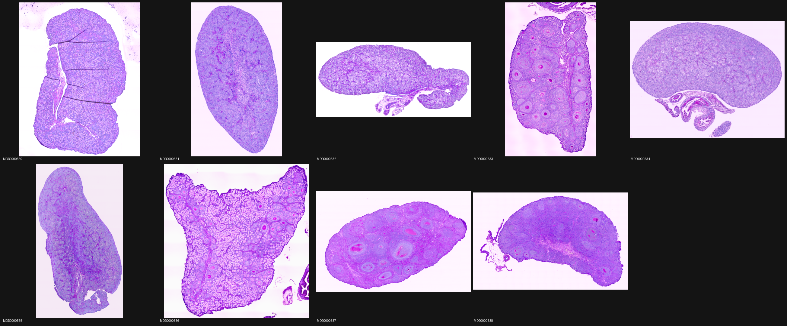

# Machine-Learning Histology Analysis of Heterogeneous glaber

Title: Machine-Learning Histology Analysis of Heterogeneous glaber

Authors: Julian Coles, Martin Orkuma, Pamela Styborski, and Silvia Tenempaguay-Nunez


**Guidelines:**

Use # for major section headers

Use ## for minor headers

Use ### for sub headers

Use **to** highlight text

Use <br /> for line breaks

Use ``` (3 backticks) before and after your code

```Python
import pandas as pd
 ``` 

Use the following format to add an image: Save the image in the images/ folder

<!--  -->

Example:

---
<br />

<br />

---


## Introduction


## Methodology
